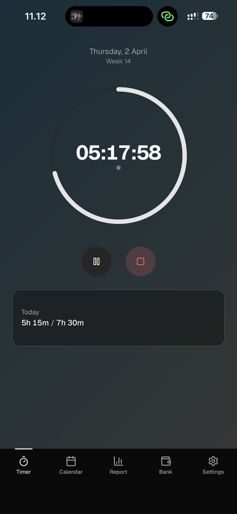
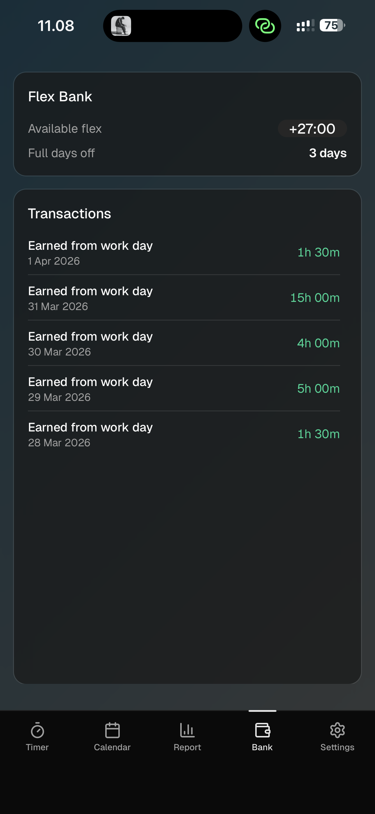
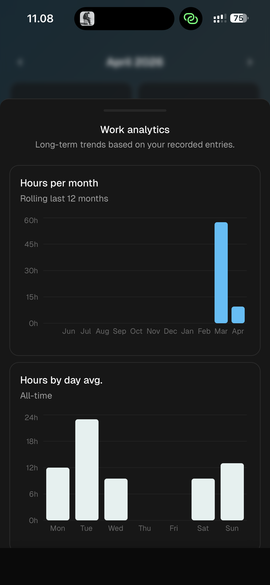
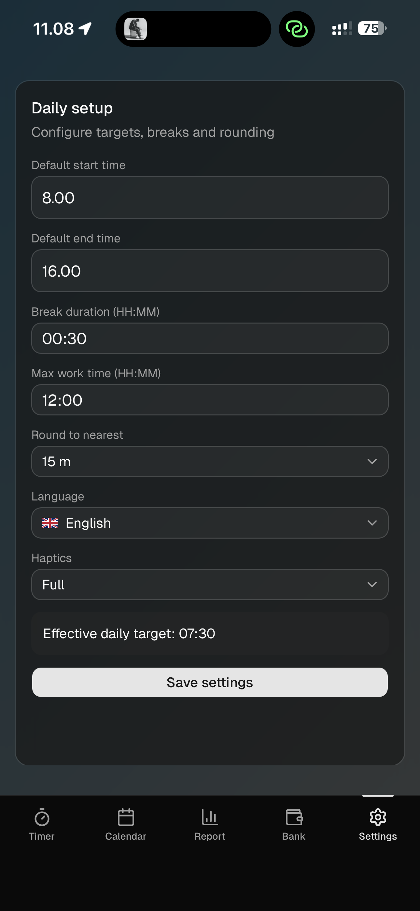

# 9toWhy

Mobile-first PWA work time tracker with clean, modern UX, lightweight performance, local-first data, flex banking, reports, and zero subscription drama; it runs directly from the GitHub Pages website with no extra packaging needed.

Open-source, so anyone can wrap it in Electron, pay Apple $99/year, and heroically sell it back to you as "premium productivity."

Because apparently every time tracker must choose one:

- beautiful but expensive
- affordable but painful
- free but looks like a 2009 admin panel

`9toWhy` is a mobile-first PWA time tracker that tries to be the rude exception.

## What It Does

- Track work with a live timer
- Add/edit day entries from calendar view
- Use flex time directly from selected time range
- See reports and a flex bank transaction view
- Save everything locally in IndexedDB (your data stays on your device)

## Install As PWA

### iOS (Safari)

1. Open the app URL in Safari.
2. Tap Share.
3. Tap **Add to Home Screen**.
4. Launch from home screen for full-screen app mode.

### Android (Chrome)

1. Open the app URL in Chrome.
2. Tap the menu (or install prompt).
3. Tap **Install app** / **Add to Home Screen**.
4. Launch from app drawer/home screen.

## Showcase

Screenshots, because if there is no visual proof, people assume this is another spreadsheet.

<p align="center">
  
  
  
  
</p>

## Local Development

```bash
npm install
npm run dev
```

## Build

```bash
npm run build
```
